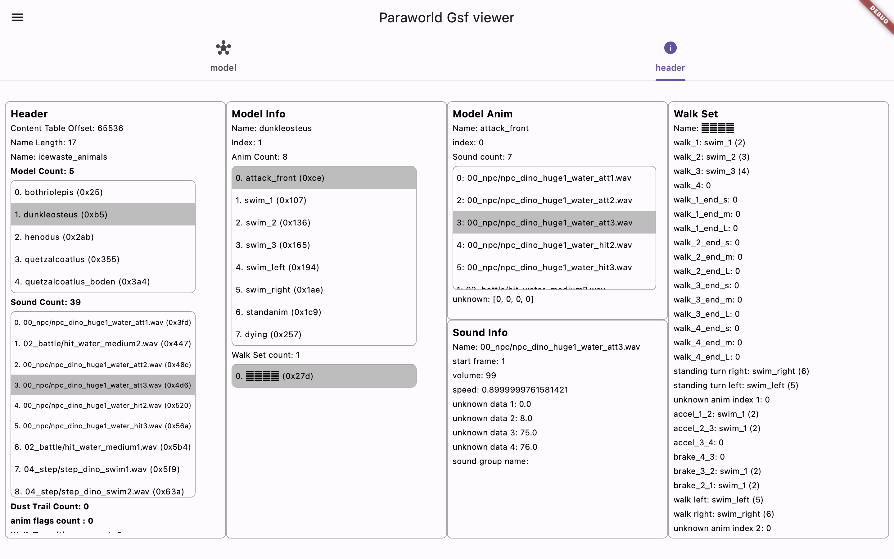

# paraworld_gsf_viewer

A project with aim to deliver a portable app capable of loading and viewing 
.GSF model files from the game ParaWorld (2005).

This would not have been possible without the help of an incredible member of the game community, Zidell, who deciphered a great part of the .GSF binary arhcitecture.

You can use the app hosted on github pages here https://arceusven1.github.io/Paraworld_gsf_viewer/

## Getting Started

This app should be able to run on any platform where the Flutter framework can compile (althought it would be unusable on iOS or Android)

To run the app simply use 
```
    flutter run -d <device eg. chrome, macOS>
```

or use the vsCode IDE with flutter and dart extension for an easy UI integration.

## Build

You can easily build for web with the included script
```sh
./build_web.sh
```

Now simply push the new version on github for auto deploy
### Features

- single static bothriolepis and test model viewing
- normals display control
- texture loading
- .obj conversion
- gsf Header 1 parsing and viewver

| View Model                                         | Toggle Normals          |
| --------------------------------------------- | ---------------------- |
| | 

| View Model information                           |
|------------------------------------------------- |
|   |


### Gsf format


### TO DO

- load model from .GSF file
- parse .GSF and display basic information (header 1 done)
- animation (might never be possible)
- convert .obj to .gsf (if we are allowed to dream)

