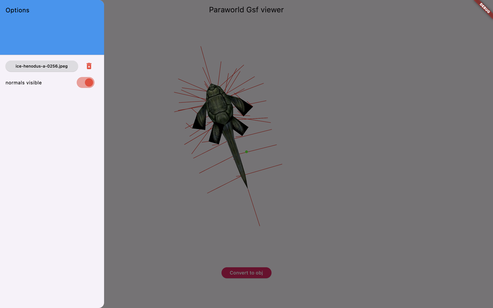
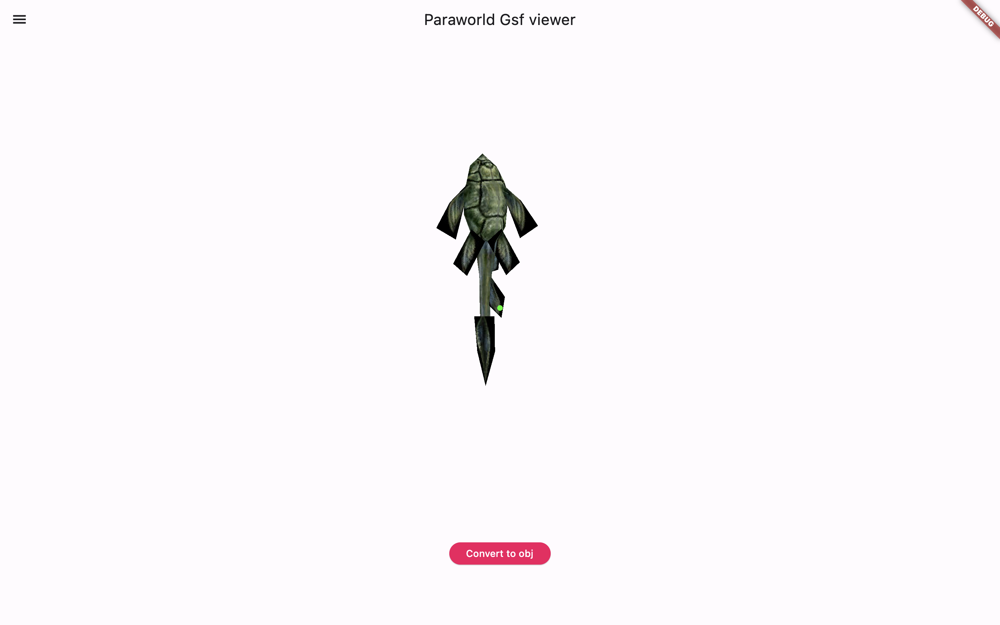

# paraworld_gsf_viewer

A project with aim to deliver a portable app capable of loading and viewing 
.GSF model files from the game ParaWorld (2005).

This would not have been possible without the help of an incredible member of the game community, Zidell, who deciphered a great part of the .GSF binary arhcitecture.

## Getting Started

This app should be able to run on any platform where the Flutter framework can compile (althought it would be unusable on iOS or Android)

To run the app simply use 
```
    flutter run -D <device>
```

or use the vsCode IDE with flutter and dart extension for an easy UI integration.

### Features

- single static bothriolepis model viewing
- normals display control
- texture loading
- .obj conversion

| View Model                                         | Toggle Normals          |
| --------------------------------------------- | ---------------------- |
| | 

| Load Texture                                    |
|------------------------------------------------ |
|   |


### TO DO

- load model from .GSF file
- parse .GSF and display basic information
- switch between models
- animation (might never be possible)
- convert .obj to .gsf (if we are allowed to dream)

