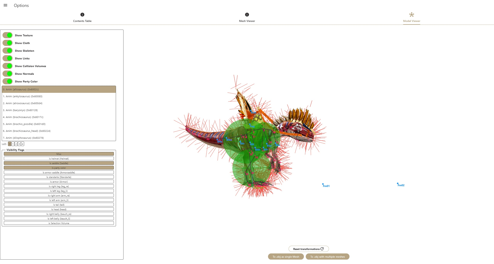
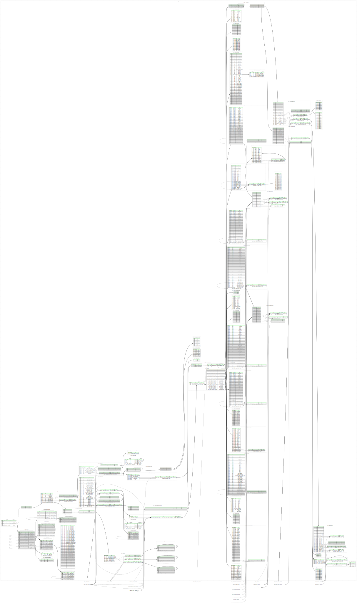

# ParaWorld GSF Viewer

A project with aim to deliver a portable app capable of loading and viewing 
.GSF model files from the game ParaWorld (2006).

This would not have been possible without the help of an incredible member of the game community, Zidell, who deciphered a great part of the .gsf binary arhcitecture.

You can use the app hosted on github pages here https://arceusven1.github.io/Paraworld_gsf_viewer/

## Getting Started

This app should be able to run on any platform where the Flutter framework can compile (althought it would be unusable on iOS or Android)

To run the app simply use 
```
    flutter run -d <device eg. chrome, macOS>
```

or use the vsCode IDE with flutter and dart extension for an easy UI integration.

## Build

You can easily build for web with the included script
```sh
./build_web.sh
```
Now simply push the new version on github for auto deploy

For windows use ```flutter build windows```

### Features

- dark and light theme
- contents table parser/viewer (header1)
- header2 parser/viewer (mesh viewer)
- model viewer with normals, skeletons, links and party color display
- full support for all static meshes
- mesh attributes handler (LoD, vis flags, misc flags)
- auto texture mapping and loading (with dds support)
- copy to clipboard feature (raw value (hex), parsed value and value pos in file)
- .obj mesh conversion (as single model or as chunks)

| Contents table                          | Mesh viewer                             |
| --------------------------------------- | ----------------------------------------|
| | 

| Model viewer                                   |
|----------------------------------------------- |
|   |


### GSF format

Use ```kaitai-struct-compiler.bat gsf.ksy -t graphviz``` to build a .dot file
And ```dot -Tsvg > output.svg gsf.dot``` for the graph
Kaitai compiler and Graphviz required

| Mesh attributes                 |
|-------------------------------- |
|   |

### TO DO

- pathfinder chunks support
- bone weights support
- billboards support
- animation (might never be possible)
- convert models to .gsf (if we are allowed to dream)

